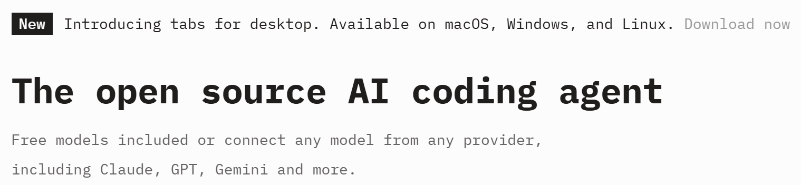
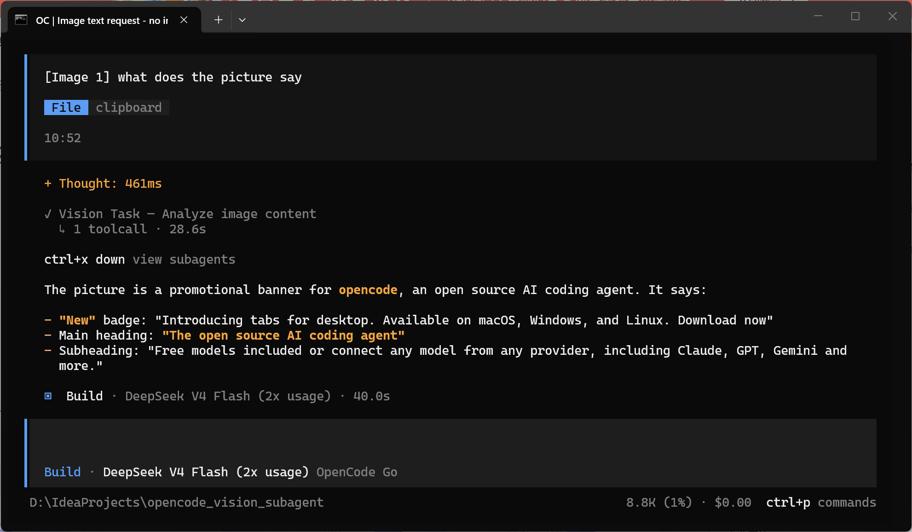

# opencode_vision：Image Analysis for OpenCode Without a Native-Vision Main Model

[English](README.md) | [中文](README.CN.md)

> Give text-only, cost-effective opencode models (e.g. `deepseek-v4-flash`) the ability to see
> images by delegating analysis to the `mimo-v2.5` vision subagent — no extra plans needed,
> the built-in opencode-go plan suffices.

## Highlights

- **Cost-effective text models, upgraded with vision.** Main models such as `deepseek-v4-flash`
  — pure-text, extremely cost-effective models from the opencode-go plan — cannot understand
  images on their own.
- **Vision via subagent.** This project uses opencode's **subagent mechanism** to give those
  text models "eyes": when the main model needs to analyze an image (screenshot, UI design,
  game frame, a pasted picture, etc.), it delegates the task to the `vision` subagent
  (vision model `mimo-v2.5`) via the `task` tool, which reads the image and returns a description.
- **No extra plans required.** Everything works with the opencode-go plan you already have;
  no additional subscription or model package is needed.

## How It Works

1. The main model encounters an image (a file path or a pasted picture).
2. It calls the `task` tool with `subagent_type="vision"`, passing the image path.
3. The `vision` subagent reads the image with the `Read` tool and returns a detailed description.
4. The main model integrates the analysis result into its answer.

## File Overview

| File | Purpose |
| --- | --- |
| `opencode.json` | Declares that `mimo-v2.5` under `opencode-go` supports image input |
| `vision.md` | Definition of the `vision` subagent (read-only, image analysis only) |
| `vision-image-handler.ts` | Pasted-image plugin: saves pasted images into `.opencode/tmp/vision/` and injects text guidance for the main model to delegate to the `vision` subagent |

## Installation

### One-liner (recommended)

Ask opencode to install it in a single sentence, e.g.:

> Install the `vision` subagent and the pasted-image plugin from this repository.

opencode will copy `vision.md` → `~/.config/opencode/agent/vision.md`,
`vision-image-handler.ts` → `~/.config/opencode/plugins/vision-image-handler.ts`, and merge the
`provider.opencode-go` block of `opencode.json` into `~/.config/opencode/opencode.json` for you.
Then quit and restart opencode.

### Manual

1. Copy `vision.md` → `~/.config/opencode/agent/vision.md`
2. Copy `vision-image-handler.ts` → `~/.config/opencode/plugins/vision-image-handler.ts`
3. Merge the `provider.opencode-go` block from `opencode.json` into `~/.config/opencode/opencode.json`
   (keep the existing `$schema`, `provider.deepseek`, `mcp`, and other fields)
4. If global plugins are loaded as npm-style plugins, make sure `@opencode-ai/plugin` is in the
   `dependencies` of `~/.config/opencode/package.json` (skip if it already exists)
5. Exit and restart opencode for the config to take effect

## Usage

- **Image files:** when the main model sees an image path, call the `task` tool with
  `subagent_type="vision"` and pass the full image path.
- **Pasted images:** after the user pastes an image, the plugin saves it to disk and injects
  delegation guidance, so the main model calls the `vision` subagent accordingly.
- It is recommended to add the following conventions to your project `AGENTS.md`:
  - When an image needs to be analyzed, do not read it directly with the `Read` tool
    (the raw bytes are not understandable);
  - Use the `task` tool to call the `vision` subagent with the full image file path.

The screenshots below show the flow: `1.png` is an example of a pasted image, and `2.png`
shows the text-only main model (here `DeepSeek V4 Flash`) delegating to the `Vision Task`
subagent and returning the description.

## Notes

- The model ID `opencode-go/mimo-v2.5` in `vision.md` must match the actual ID under `opencode-go`
  (run `/models` inside opencode to confirm; if it differs, update the model ID in `vision.md`).
- The image storage directory `.opencode/tmp/vision/` is ignored by each project's `.gitignore`
  and never enters the repository.
